<div align="center">


# Jellysic

**A fast, native-feeling desktop music client for [Jellyfin](https://jellyfin.org).**

Tauri 2 and Svelte 5 for the interface, a Rust audio engine underneath.
No Electron, no external mpv binary.

[](https://github.com/Ariazonaa/jellysic/releases/latest)
[](https://github.com/Ariazonaa/jellysic/actions/workflows/ci.yml)
[](LICENSE)


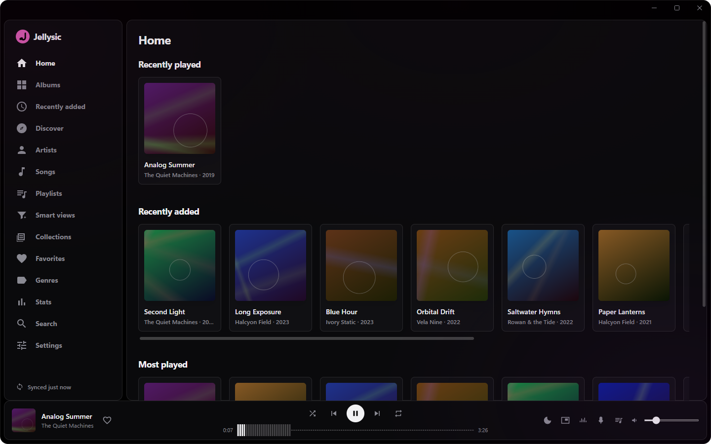

[Download](#download) · [Screenshots](#screenshots) ·
[How it works](#architecture-in-one-paragraph) ·
[How it compares](#how-it-compares) · [Getting started](#getting-started) ·
[Contributing](#contributing) · [Security](#security)

</div>

---

Jellysic started as an answer to "Feishin, but better". The audio path lives in
Rust: decode, DSP, gapless, crossfade, output device. The WebView draws the
interface and nothing else.

> **Status:** actively developed, feature-rich, and daily-usable. Not yet 1.0.
> Planned work and known gaps are tracked in
> [issues](https://github.com/Ariazonaa/jellysic/issues). Windows-first, but
> the architecture keeps Linux/macOS open (no Windows-only shortcuts baked into
> the core).

## Download

The installer is on the
[releases page](https://github.com/Ariazonaa/jellysic/releases/latest). Windows
10 or 11, 64-bit, about 7 MB. It installs for the current user, so it does not
ask for administrator rights, and it does not need anything else on the machine:
WebView2 already ships with Windows.

There is also a portable zip if you would rather not install anything: the exe
is self-contained, the interface is embedded in it.

It is not code-signed, so SmartScreen calls the publisher unknown. **More info →
Run anyway.** That is a reputation problem rather than a technical one, and it
is on the list. Every release carries a `SHA256SUMS.txt`, and the builds are
produced by [the release workflow](.github/workflows/release.yml) from the
tagged commit rather than on someone's machine.

From 0.2.0 on, the installed app keeps itself current: it asks once per start
whether a newer version exists (you can switch that off) and installs it from
Settings when you say so — never while a track is playing, and only after the
download's signature checks out against the project's key. The portable zip
cannot do that; it gets its new version by hand.

What changed between versions is in [`CHANGELOG.md`](CHANGELOG.md). Building
it yourself is under [Getting started](#getting-started).

## Highlights

Folded up by area; the full list, with the reasoning, is in
[`docs/features.md`](docs/features.md).

<details open>
<summary><b>Playback (all in Rust)</b></summary>

- Symphonia + rodio engine — FLAC / MP3 / Vorbis / WAV, plus a libopus-backed
  decoder for Ogg-Opus.
- **True gapless** (next track opened ahead and appended sample-accurately) and
  opt-in **smart crossfade**.
- 10-band EQ, normalization **per track or per album** and click-free
  pause/resume (a sample-accurate fade stage); seeking even inside a live
  server transcode.
- Output-device selection with automatic fallback on device hotplug; sleep timer
  with fade-out, and **stop after this track or this album** from the queue.

</details>

<details>
<summary><b>Library & queue</b></summary>

- Albums / artists / genres with an A–Z scrubber, virtualized grids, favorites,
  home rows, recently-added, multi-disc, play counts.
- Search 2.0 with history; instant mix and similar-artists; a **statistics
  dashboard** with the library's numbers, the most played artists and the
  albums per decade.
- **Tag editing for a whole selection** — album artist, genres or year across
  many tracks at once.
- The **queue is a single source of truth in Rust** — shuffle / repeat /
  album-shuffle, one-step undo, dedup and played-cleanup, and it **survives
  restarts** (persisted to SQLite).
- Playlists: full CRUD, drag-and-drop reorder, dedup, duplicate, cross-playlist
  transfer, "save the queue as a playlist", and **in the sidebar with tracks
  and albums dropped onto them**.

</details>

<details>
<summary><b>Discovery</b></summary>

- A Discover hub, **dynamic smart views** (server-side filters you can save and
  materialize to a static playlist), decade rows, read-only Collections/BoxSets.
- **Auto-DJ** that keeps the music going from a track / artist / genre / album /
  playlist seed.

</details>

<details>
<summary><b>Now playing & visuals</b></summary>

- Synced **lyrics** (line- and word-level), panel + fullscreen, per-track offset.
- Ambient now-playing backdrop derived from cover art.
- A **Butterchurn (MilkDrop) visualizer**: 393 presets across seven bundled packs, plus the
  opt-in online Butterchurn Weekly pack, preset browser, beat-sync, sensitivity/quality controls, screenshots,
  and a **projector window** you can throw onto a second monitor with overlays.

</details>

<details>
<summary><b>Desktop integration</b></summary>

- Windows **SMTC** (media keys + the OS now-playing overlay), system tray with a
  background mode, a frameless **mini-player** window.
- **Drops to ~115 MB in the background.** Hidden or minimised, the WebView is
  suspended and the music keeps playing from the Rust side.
- **ListenBrainz** scrobbling (playing-now + listens on the ≥4 min / ≥50 % rule).
- Command palette (`Ctrl+K`), fully **configurable keyboard shortcuts**, context
  menus with multi-select everywhere.

</details>

<details>
<summary><b>Look & feel</b></summary>

- **AMOLED dark**: a true-black ground, a short ladder of near blacks, hairlines
  instead of light edges. The accent follows the playing cover by default
  (kept readable against the black), or pick one of 8 presets or your own.
- View-density and layout presets; skeletons, empty states, an offline banner,
  and a stale-while-revalidate cache for instant navigation.

</details>

<details>
<summary><b>Security & trust</b></summary>

- Self-signed home servers are handled by **per-server SHA-256 certificate
  pinning** (a custom rustls verifier) — no blanket "accept invalid certs".
- Auth tokens live in the **OS credential store**, never in the DOM or in SQLite.

</details>

## Screenshots

<table>
  <tr>
    <td width="50%">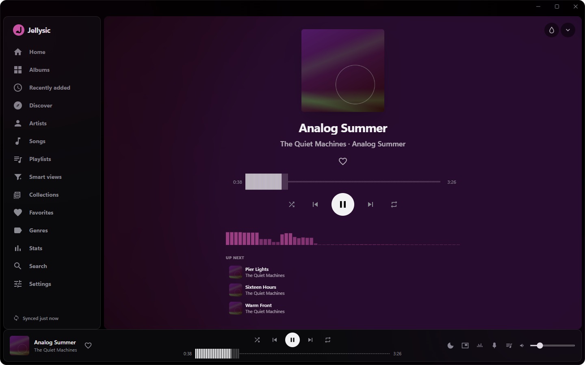</td>
    <td width="50%">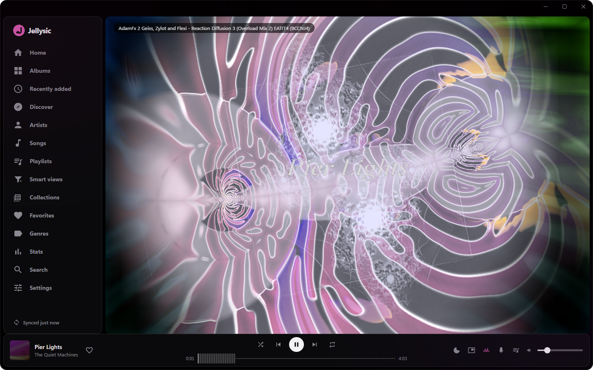</td>
  </tr>
  <tr>
    <td align="center"><b>Now playing</b> — cover backdrop, waveform, up next</td>
    <td align="center"><b>Visualizer</b> — 393 MilkDrop presets via Butterchurn</td>
  </tr>
  <tr>
    <td>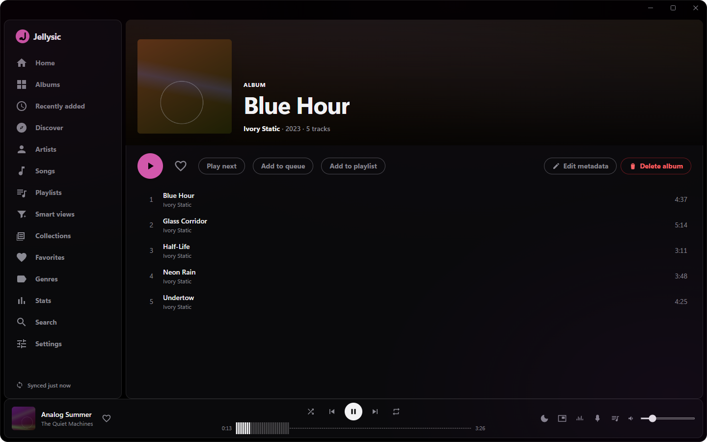</td>
    <td>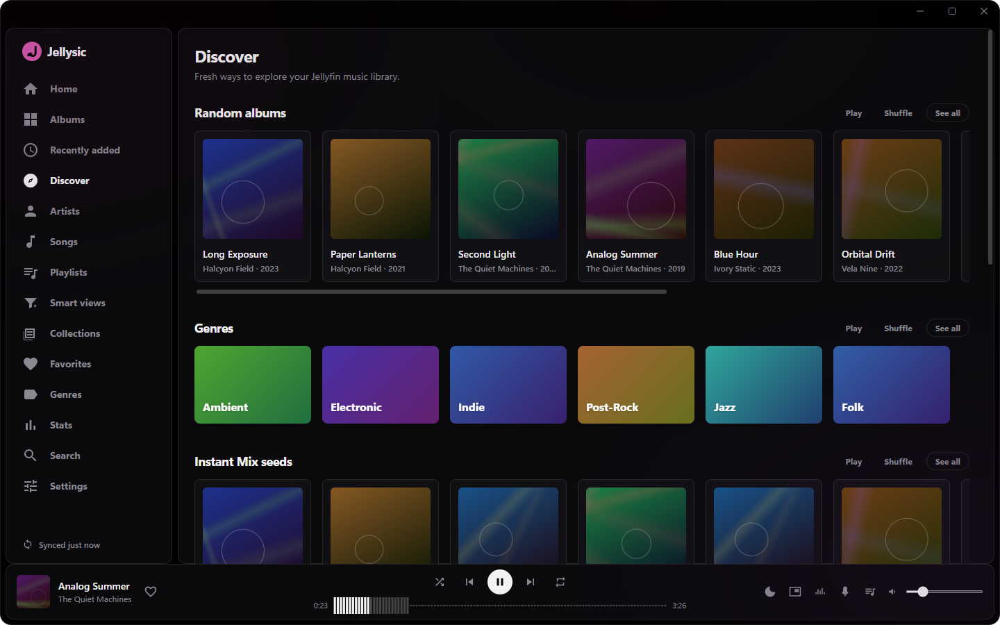</td>
  </tr>
  <tr>
    <td align="center"><b>Album</b> — tracks, favorites, queue actions</td>
    <td align="center"><b>Discover</b> — random albums, genres, instant mixes</td>
  </tr>
  <tr>
    <td>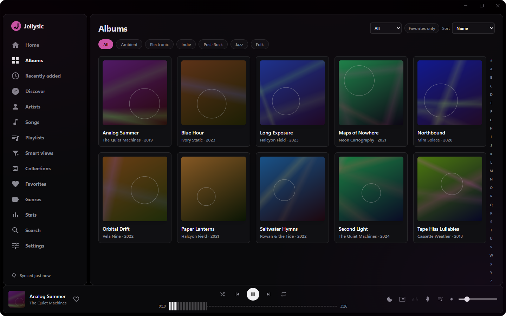</td>
    <td>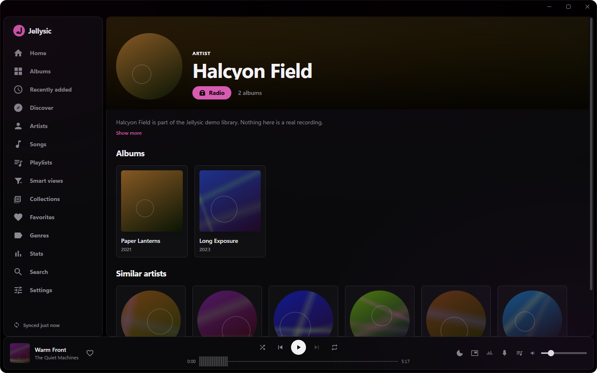</td>
  </tr>
  <tr>
    <td align="center"><b>Library</b> — virtualized grid, A–Z scrubber</td>
    <td align="center"><b>Artist</b> — albums, top tracks, similar artists</td>
  </tr>
  <tr>
    <td>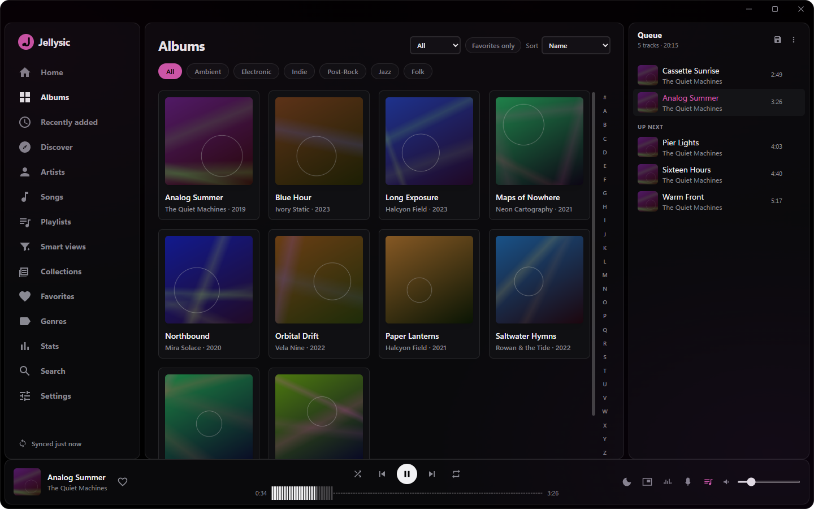</td>
    <td>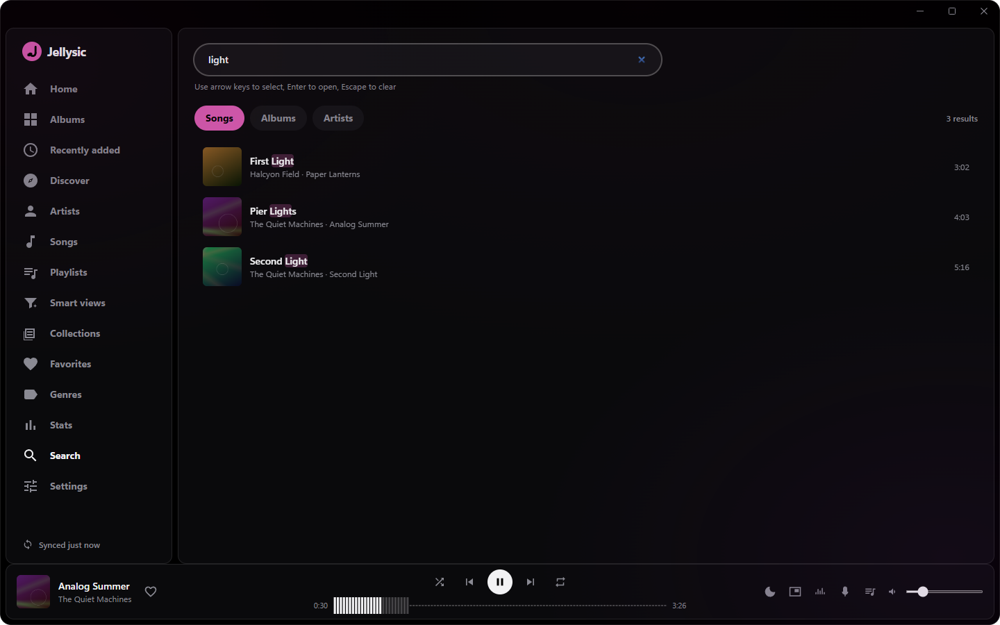</td>
  </tr>
  <tr>
    <td align="center"><b>Queue</b> — drag to reorder, one-step undo</td>
    <td align="center"><b>Search</b> — across albums, artists and tracks</td>
  </tr>
  <tr>
    <td>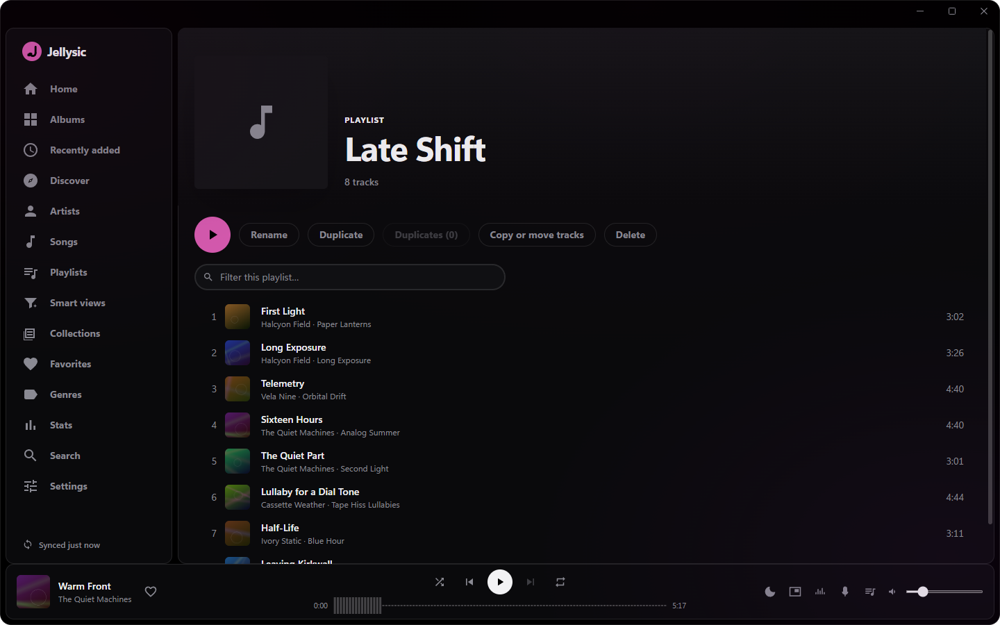</td>
    <td>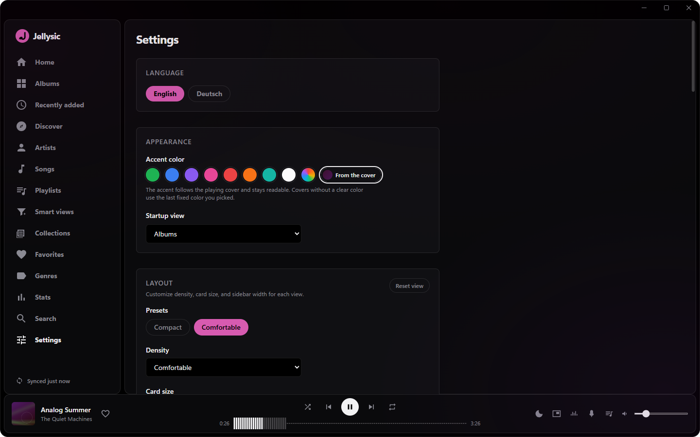</td>
  </tr>
  <tr>
    <td align="center"><b>Playlists</b> — reorder, dedup, transfer</td>
    <td align="center"><b>Settings</b> — EQ, output device, accent, shortcuts</td>
  </tr>
</table>

<sub>Screenshots come from a generated demo library
(<a href="scripts/devserver/README.md"><code>scripts/devserver</code></a>).
The artists, albums and cover art are invented. Nothing here is anyone's real
collection.</sub>

## Architecture in one paragraph

> New here? The [feature walkthrough](docs/usage.md) tours the app from sign-in
> to the visualizer, and [`docs/architecture.md`](docs/architecture.md) shows how
> the backend works in diagrams.

Two worlds joined by Tauri commands (UI → Rust) and events (Rust → UI). The
**WebView renders UI and nothing else** — every Jellyfin request (auth, browsing,
cover art, audio streams) goes through Rust/`reqwest`, so plain-HTTP and
self-signed home servers just work and tokens never touch the DOM. A dedicated
`jellysic-player` OS thread owns the rodio output, the queue, playback reporting
and the Windows SMTC; sources are decoded by Symphonia (or libopus) and run
through a DSP → fade → visualizer-tap chain. Cover art reaches the UI through a
custom, disk-cached `jfimg://` protocol.

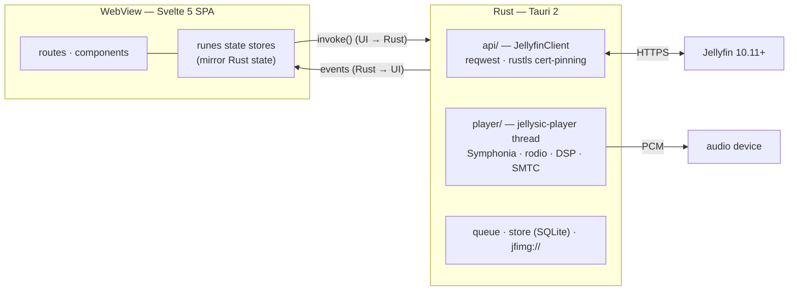

**Visual deep-dive:** the full set of component/threading/sequence diagrams
(gapless, 401-retry, cert-pinning, cover art …) lives in
[`docs/architecture.md`](docs/architecture.md).

## How it compares

Four Jellyfin music clients for Windows, measured the same way.

All four ran against the same local Jellyfin stand-in
([`scripts/devserver`](scripts/devserver/README.md)) with the same 10-album
library, signed in, idle on their library view, default window size. Each run
settles for 15 seconds, then samples for 45. Two runs per client, median of the
settled samples. Memory is summed across the whole process tree, because a
browser engine spreads itself over several processes and counting only the
parent would flatter it. One Windows 11 machine, so read the shape rather than
the exact digits.

<p align="center">
  <picture>
    <source media="(prefers-color-scheme: dark)" srcset="docs/bench-dark.svg">
    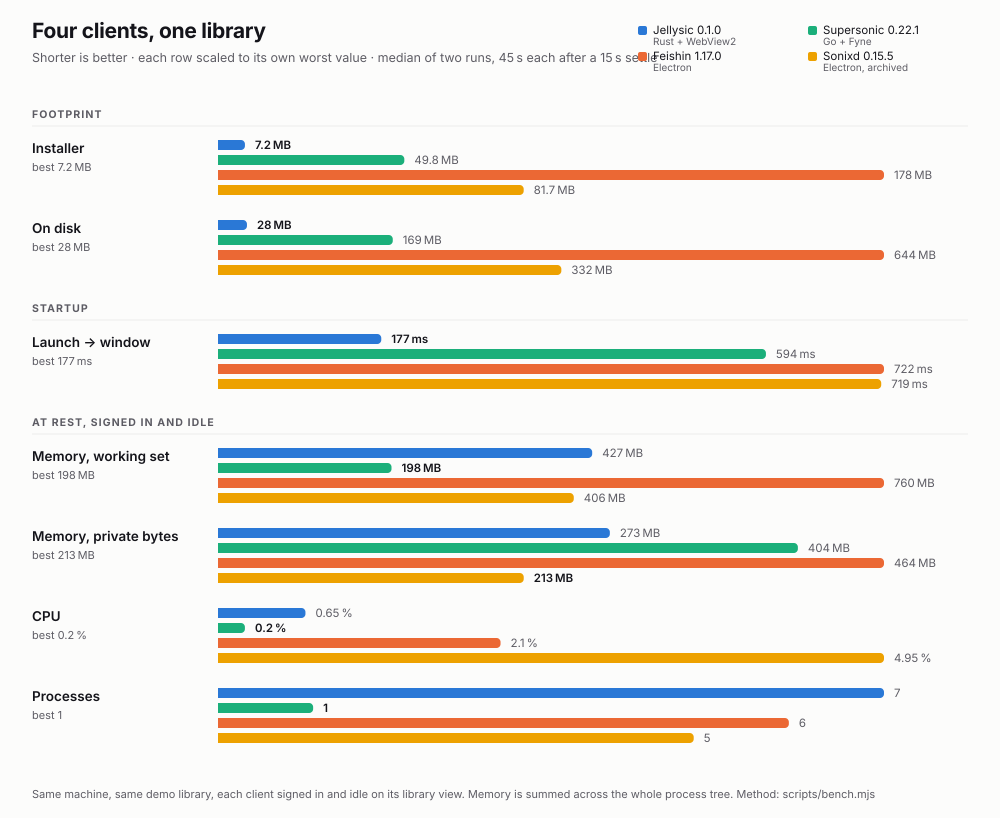
  </picture>
</p>

<details>
<summary><b>The same figures as a table</b></summary>

| | Jellysic 0.1.0 | Supersonic 0.22.1 | Feishin 1.17.0 | Sonixd 0.15.5 |
| --- | ---: | ---: | ---: | ---: |
| Runtime | Rust + WebView2 | Go + Fyne | Electron | Electron |
| Installer | **7.2 MB** | 49.8 MB | 178 MB | 81.7 MB |
| On disk | **28 MB** | 169 MB | 644 MB | 332 MB |
| Launch → window | **177 ms** | 594 ms | 722 ms | 719 ms |
| Memory, working set | 427 MB | **198 MB** | 760 MB | 406 MB |
| Memory, private bytes | 273 MB | 404 MB | 464 MB | **213 MB** |
| CPU, idle | 0.65 % | **0.2 %** | 2.1 % | 4.95 % |
| Processes | 7 | **1** | 6 | 5 |

Sonixd has been archived since February 2024. It is here because it is Feishin's
predecessor and still widely installed, not as a live competitor.

Jellyfin Media Player, the official desktop client, is deliberately absent. It
is a video player that also plays music: its library view is films and series,
so "idle on the library view" would not mean the same thing as it does for the
four above. For scale, its installer is 149 MB and it takes 338 MB on disk.

Reproduce it: start `node scripts/devserver/server.mjs`, sign each client in at
`http://127.0.0.1:8096`, then run
`node scripts/bench.mjs --exe <path> --label <name>` against each. The chart
comes from `node scripts/bench-chart.mjs`.

</details>

Jellysic ships the smallest installer, takes the least disk and opens its
window first, by a wide margin in all three. Supersonic uses the least memory
and the least CPU. Neither result is an accident.

Of Jellysic's 427 MB, about 47 MB is its own process. The rest is WebView2:
116 MB for the browser process, 104 MB for the GPU process, 88 MB for the
renderer, and a handful of utility processes. Supersonic has none of that. It
is a Go program drawing its own widgets, so 198 MB is the whole thing in one
process. That is the trade Jellysic makes: a browser engine for the interface,
paid for in resident memory, in exchange for the web toolchain and a 7 MB
installer, because the engine is already on the machine.

That trade only has to be paid while you are looking at it. Audio runs on a
Rust thread, not in the WebView, so once the window goes to the tray or gets
minimised there is nothing left for the WebView to do, and WebView2 is told to
release the renderer. Measured with a track playing: **442 MB visible, 115 MB
in the background**, with the server still receiving a progress report every
ten seconds throughout. An Electron client cannot do this, because the audio it
would have to keep alive lives inside the renderer it would have to suspend.

Worth flagging: the two memory columns disagree. Supersonic holds 198 MB
resident but commits 404 MB, because Go reserves generously up front. Sonixd is
the reverse. Working set is the closer answer to "how much RAM is this using
right now".

Features overlap more than the framing suggests. Feishin and Supersonic both
have an equalizer, scrobbling and lyrics, and Feishin has a visualizer too.
What Jellysic does differently is where the audio lives.

## Tech stack

- **Frontend:** Svelte 5 (runes), SvelteKit (`adapter-static`, SPA), Tailwind v4,
  Paraglide i18n (en/de), `virtua` for virtualization, Butterchurn.
- **Backend:** Rust, Tauri 2, Symphonia + rodio + libopus, `reqwest`, `rustls`
  (custom `ServerCertVerifier`), SQLite, `souvlaki` (SMTC/MPRIS), `cpal`.
- **Tests:** Vitest (jsdom) for the frontend, `cargo test` + `proptest` for Rust,
  WebdriverIO + `tauri-driver` for end-to-end.

## Getting started

Prerequisites: **Rust** (MSVC toolchain + the C++ build tools), **Node.js 22+**,
**cmake** on `PATH` (the `opus` crate builds bundled libopus), and a **Jellyfin
server 10.11+**.

```powershell
npm install
npm run tauri dev      # run the app in dev (Vite on :1420 + cargo run, hot reload)
```

On first launch, point it at your server and sign in (username/password or
Quick Connect). Self-signed certificates prompt you to verify and pin a
fingerprint.

### Common commands

```powershell
npm run tauri dev        # dev app
npm run check            # svelte-check (0 errors / 0 warnings is the bar)
npm run test             # frontend unit tests (Vitest)
npm run test:e2e         # end-to-end tests against the built app (see e2e/README.md)
npm run verify           # the full quality gate (check + test + fmt + clippy + cargo test + build)
npm run tauri build      # release build + NSIS installer
```

## Testing & CI

`npm run verify` is the one-command quality gate and mirrors CI exactly:
`svelte-check` → frontend unit tests → `cargo fmt --check` →
`clippy -D warnings` → `cargo test --lib` → frontend build. The Rust suite
includes DSP, decoder, fade, scrobble and queue tests, with **property tests**
for the queue invariants. End-to-end tests drive the real built app through
WebView2 (WebdriverIO → `tauri-driver`). Details and the manual live-test matrix
are in [`docs/testing.md`](docs/testing.md) and [`e2e/README.md`](e2e/README.md).

CI runs the same gates on every push and pull request
([`.github/workflows/ci.yml`](.github/workflows/ci.yml)) on a Windows runner.
The workflow installs Node, Rust and cmake itself and sets up the MSVC
environment, so it needs nothing beyond the image's C++ build tools.

## Project layout

```
src/                     SvelteKit frontend (routes, components, runes state, i18n)
src-tauri/src/           Rust: api/ · player/ · commands*.rs · store · tls · jfimg
e2e/                     WebDriver end-to-end harness (wdio.conf + specs)
docs/testing.md          test inventory + manual acceptance matrix
messages/{en,de}.json    all user-facing strings (Paraglide)
```

## Documentation

| Guide | What's in it |
| --- | --- |
| [`docs/usage.md`](docs/usage.md) | A feature walkthrough — sign-in → library → queue → discovery → visualizer. |
| [`docs/architecture.md`](docs/architecture.md) | How the backend works, told in diagrams: the player thread, the audio source chain, gapless/crossfade, 401-retry, cert-pinning, cover art. |
| [`docs/testing.md`](docs/testing.md) | Test inventory + the manual live-test acceptance matrix. |

## Contributing

Issues and pull requests are welcome. [`CONTRIBUTING.md`](CONTRIBUTING.md) has
the long version: how to set up, how to work without a Jellyfin server, and
what gets a patch sent back. Two things up front.

**`npm run verify` has to pass.** It runs what CI runs: `svelte-check` at zero
errors and zero warnings, the frontend tests, `cargo fmt --check`,
`clippy -D warnings`, `cargo test --lib`, and a production build. Details in
[`docs/testing.md`](docs/testing.md).

**Three rules are not style preferences.** The WebView never touches audio or
HTTP: every Jellyfin request goes through Rust, so tokens never reach the DOM.
User-facing strings live in `messages/{en,de}.json`, aria-labels included.
Colors come from the design tokens in `src/app.css`, never as literals in a
component. A patch that breaks one of those gets sent back.

Jellysic is clean-room: no Feishin code or assets, only concepts. The licence
now permits more than that. The provenance stays as it is anyway.

By taking part you agree to the [Code of Conduct](CODE_OF_CONDUCT.md).

## Security

Tokens live in the Windows Credential Manager and never reach the DOM,
certificates are pinned per server, and the online visualizer packs are
verified against a pinned manifest before anything is evaluated.
[`SECURITY.md`](SECURITY.md) writes that out and says how to report
something privately — please use that channel rather than an issue.

## License

[GPL-3.0-or-later](LICENSE). Copyright (C) 2026 Ariazonaa.

Jellysic bundles no third-party source. The dependencies are permissively
licensed (MIT, Apache-2.0, ISC). The one exception is **Symphonia** under
MPL-2.0, a file-level copyleft that binds changes to Symphonia's own files.
Jellysic makes none. Decoding also uses **libopus** (BSD-3-Clause), the
visualizer uses **Butterchurn** (MIT).

Jellyfin is a trademark of the Jellyfin project. Jellysic is an independent
client and is not affiliated with or endorsed by it.
