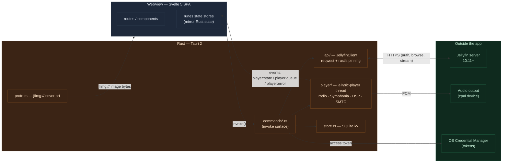
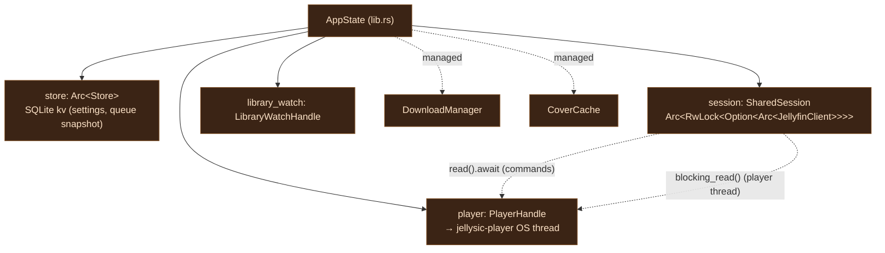
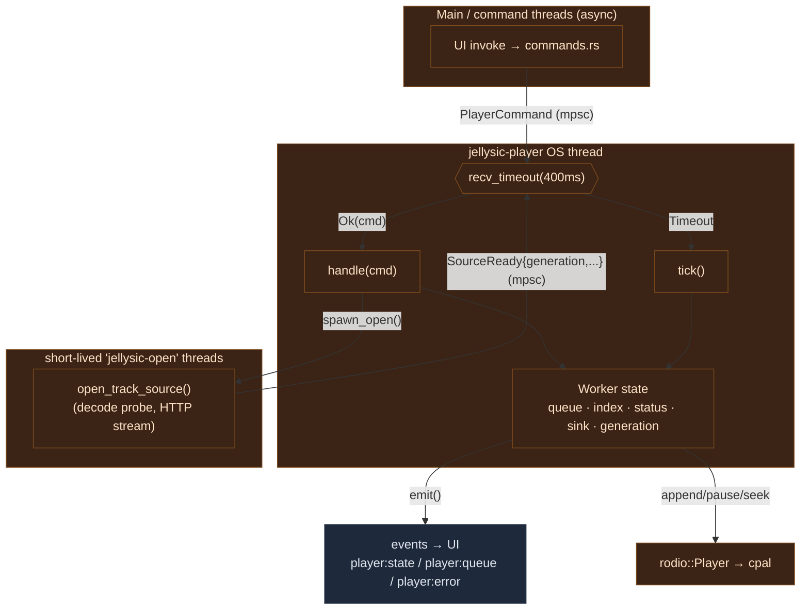
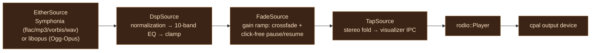
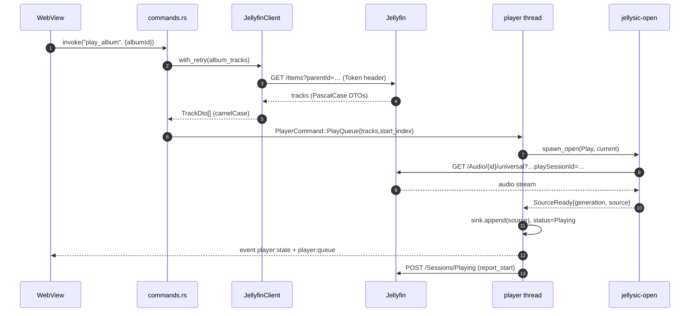
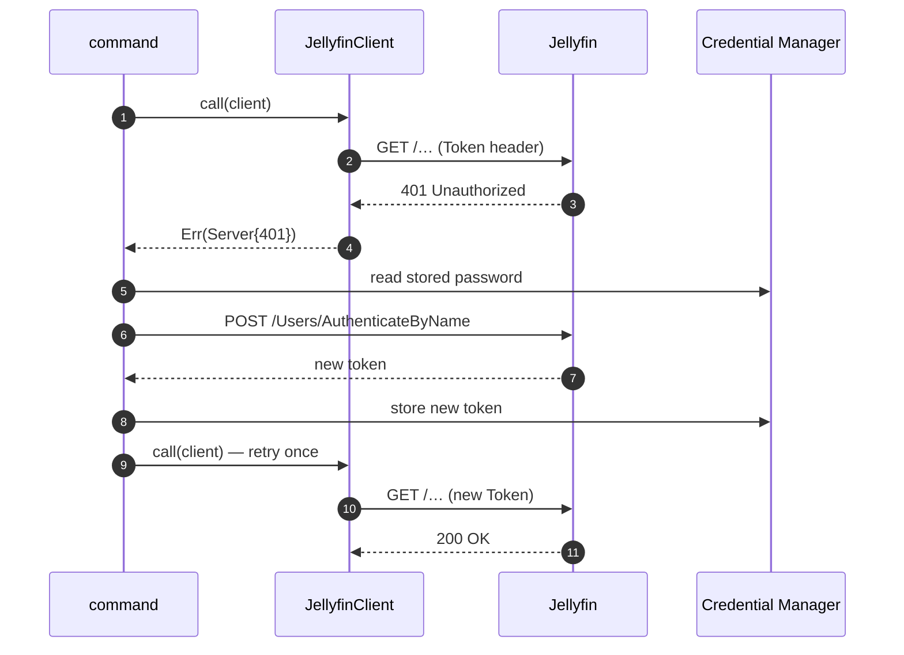
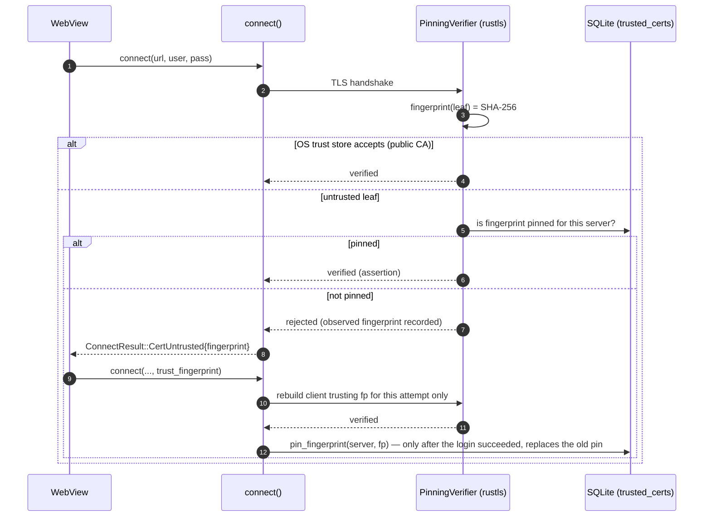
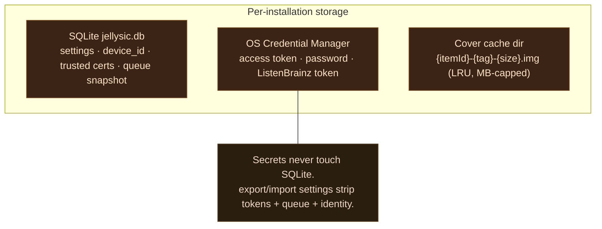

# Architecture — how Jellysic works

This page shows how the backend works, in diagrams. Every diagram
below is [Mermaid](https://mermaid.js.org/) and renders directly on Gitea/GitHub.
The goal: show *how the backend actually works* without reading the whole Rust
tree first.

Two rules explain almost everything:

1. **The WebView renders UI and nothing else.** No audio, no HTTP, no tokens in
   the DOM. Every Jellyfin request and every sample of audio goes through Rust.
2. **The queue is a single source of truth in Rust.** The UI never computes
   playback state — it mirrors what the player thread emits.

---

## 1. The big picture

Two worlds joined by **Tauri commands** (UI → Rust) and **events** (Rust → UI).



**Why this split matters:** because Rust owns HTTP, plain-HTTP and self-signed
home servers "just work", tokens never touch the DOM, and the audio path is not
at the mercy of a browser's media stack.

---

## 2. AppState — what the backend owns

At startup `lib.rs::run()` builds one `AppState` and hands clones of the shared
pieces to every subsystem.



`SharedSession` is the one `JellyfinClient` shared between the async command
world and the plain-OS-thread player. Commands take it with `read().await`; the
player thread (not inside the async runtime) uses `blocking_read()`.

---

## 3. The player thread

A single dedicated OS thread named `jellysic-player` owns the audio output, the
queue, playback reporting and the Windows SMTC for the whole app lifetime. It is
driven by an mpsc channel with a **400 ms timeout** — commands when they arrive,
a periodic `tick()` when they don't.



**Never block the loop.** Sources are opened on throwaway `jellysic-open`
threads and delivered back as a `SourceReady` command; a `generation` counter
lets the worker throw away results that a newer play/seek has already
invalidated.

### What the 400 ms tick does

```mermaid
flowchart LR
    T0["tick()"] --> A["retry deferred output failure"]
    A --> B["drop finished crossfade tails"]
    B --> C["maybe_transition()<br/>gapless / end-of-track"]
    C --> D["sleep-timer fade + deadline"]
    D --> E["progress report every ~25 ticks (~10s)"]
    E --> F["schedule_prefetch()"]
    F --> G["maybe_auto_dj()"]
    G --> H["update SMTC + emit()"]

    classDef box fill:#3b2415,stroke:#7c4a1e,color:#fde3c8;
    class T0,A,B,C,D,E,F,G,H box;
```



---

## 4. The audio source chain

Every playing track is a stack of iterator wrappers. Each `next()` sample flows
from the decoder outward:



- **DSP** is live-editable: it polls a revision counter every ~1024 samples, so
  EQ/normalization changes apply without reopening the stream.
- **Fade** is sample-accurate and steered by a shared handle — it powers both
  crossfade and click-free pause/resume.
- **Tap** is the outermost wrapper and costs *an atomic load and a sample
  counter* per sample when no visualizer is open (the counter keeps left/right
  aligned when a feed starts mid-stream); otherwise it folds any layout to
  stereo and ships 2048-frame interleaved L/R frames over a bounded queue so the
  audio callback never blocks.

---

## 5. Gapless vs. crossfade

The next track is prepared *before* the current one ends. Which path is taken
depends on the crossfade setting and whether the two tracks form an album
sequence.

```mermaid
sequenceDiagram
    autonumber
    participant Tick as tick() loop
    participant Open as jellysic-open
    participant Sink as rodio::Player

    Note over Tick: ~20s remaining
    Tick->>Open: spawn_open(Prefetch, next)
    Open-->>Tick: SourceReady → self.prefetched

    alt Gapless (no crossfade / album sequence)
        Note over Tick: ~3s remaining
        Tick->>Sink: sink.append(next)  (same sink)
        Note over Tick,Sink: sink.len() drops to 1
        Tick->>Tick: handle_transition() → index++, promote fade/tap
    else Crossfade (opt-in, non-album boundary)
        Note over Tick: fade window
        Tick->>Sink: new Player, fade-in next
        Tick->>Sink: ramp old sink → 0, mute its tap
        Tick->>Tick: index moves immediately; drop old tail after fade
    end
```

`rodio`'s position tracker follows the current source, so the reported position
resets automatically at the boundary — no manual bookkeeping for gapless.

---

## 6. Playing an album (end-to-end)



Each queued track carries a `playSessionId` generated at queue-build time. It is
embedded both in the stream URL and in the `/Sessions/Playing*` reports so the
server can correlate — and later kill — transcode jobs.

---

## 7. Auto-relogin on 401

Every server command is wrapped in `with_retry`. A dead token triggers a silent
re-login using the password stored in the OS credential manager, then the call
is retried exactly once.



`validate()` distinguishes a *dead token* (401/403 → log out) from an
*unreachable server* (network error → stay logged in, show offline banner).

---

## 8. Certificate pinning (self-signed home servers)

There is **no blanket "accept invalid certs"**. A custom rustls verifier checks
the OS trust store first and only accepts an untrusted leaf whose SHA-256
fingerprint the user has explicitly pinned.



Fingerprints are stored **per `server_url`** in SQLite, so pinning one home
server never weakens another.

---

## 9. Cover art — the jfimg:// protocol

The WebView can't fetch authenticated images itself (no token in the DOM), so a
custom, disk-cached protocol does it.

```mermaid
sequenceDiagram
    autonumber
    participant WV as WebView &lt;img&gt;
    participant P as proto.rs (jfimg)
    participant FS as disk cache
    participant API as JellyfinClient
    participant JF as Jellyfin

    WV->>P: GET jfimg://…/{itemId}/{tag}/{size}
    alt cache hit
        P->>FS: read + touch (mtime for LRU)
        FS-->>P: bytes
    else cache miss
        P->>API: fetch_image(itemId, tag, size)
        API->>JF: GET /Items/{id}/Images/Primary
        JF-->>API: image bytes
        P->>FS: write temp → atomic rename
        P->>FS: schedule LRU eviction (to 80% headroom)
    end
    P-->>WV: bytes + Access-Control-Allow-Origin: *
```

The `Access-Control-Allow-Origin: *` header is what lets the frontend read cover
pixels into a canvas (for the ambient now-playing backdrop) without tainting it.
Windows SMTC artwork reuses the same disk cache via `file://` URLs.

---

## 10. Where things live on disk



---

## Reading order in the source

If you want to follow this in code:

| Concern | Start here |
| --- | --- |
| App wiring, managed state | `src-tauri/src/lib.rs` |
| Invoke surface | `src-tauri/src/commands*.rs` |
| Player thread & queue | `src-tauri/src/player/mod.rs` |
| Source chain | `src-tauri/src/player/{source,dsp,fade,tap,opus}.rs` |
| HTTP client | `src-tauri/src/api/{mod,types}.rs` |
| TLS pinning | `src-tauri/src/tls.rs` |
| Cover art | `src-tauri/src/proto.rs`, `src-tauri/src/cache.rs` |
| Storage | `src-tauri/src/store.rs` |

The rules those modules are written against, in short: the WebView never
touches audio or HTTP, user-facing strings live in `messages/{en,de}.json`, and
colors come from the design tokens in `src/app.css`.
