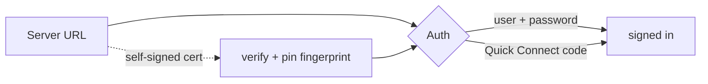
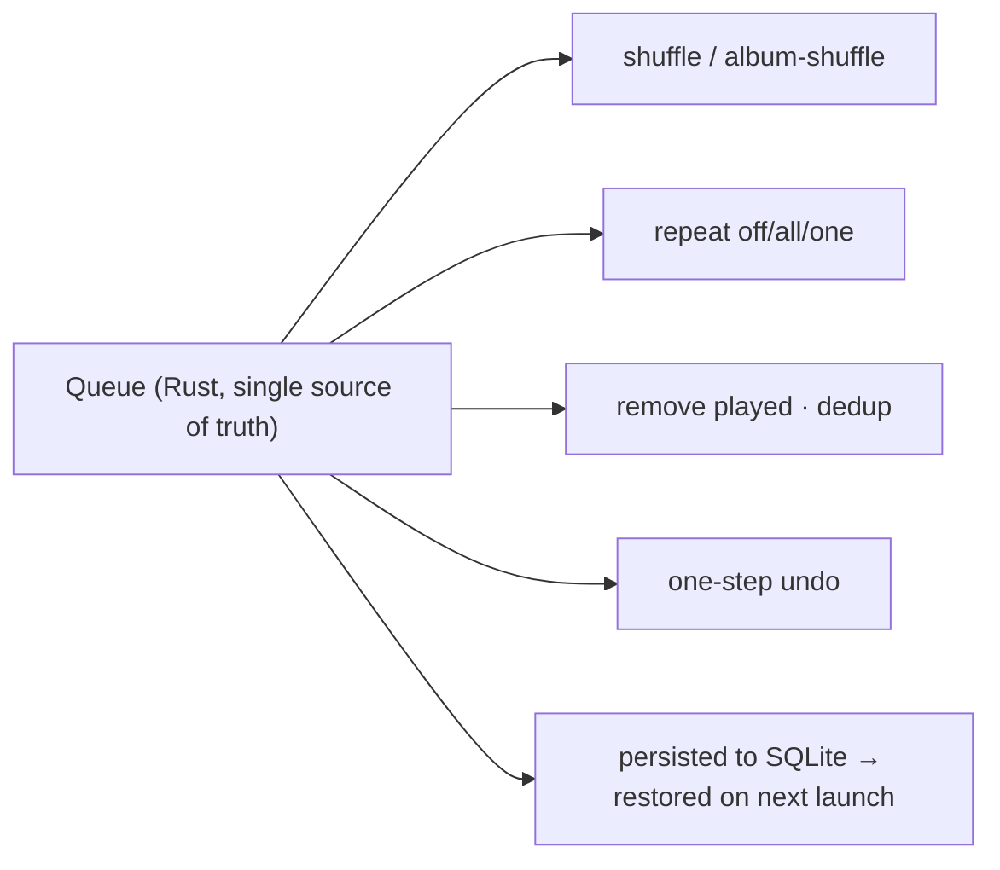
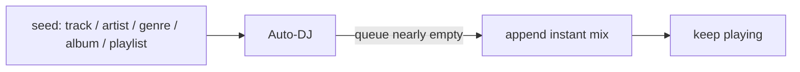

# Usage — a walkthrough of the client

A tour of Jellysic from first launch to the visualizer projector. It follows the
real routes and features, so it doubles as a "what can this thing do" reference.

The diagrams below (Mermaid) render on Gitea/GitHub as-is.

---

## 1. First launch & sign-in

On first start you land on the connect screen
(`src/lib/components/SetupScreen.svelte`).

1. Enter your **server URL** (e.g. `https://music.example.com` or a plain-HTTP
   LAN address).
2. Sign in with **username + password**, or use **Quick Connect** (enter the
   code shown here on any already-signed-in Jellyfin client).
3. **Self-signed certificate?** Jellysic shows the server's SHA-256 fingerprint
   and asks you to confirm it once. After you accept, the fingerprint is pinned
   for *that* server — you won't be asked again, and other servers are
   unaffected. (Details: [architecture §8](architecture.md#8-certificate-pinning-self-signed-home-servers).)

Your access token goes straight into the **OS credential manager**, never into
the app's database or the WebView. On later launches the session restores
silently; if the token has expired the app re-logs in for you in the background.

---

## 2. Home & the library

After sign-in you're in the main shell: sidebar navigation on the left, content
on the right, and a persistent **player bar** at the bottom.

- **Home** (`/home`) — "recently added", "recently played", "most played" and
  more, built as horizontal rows.
- **Albums / Artists / Genres / Songs** — the big views are virtualized (they
  stay smooth with tens of thousands of items). Albums (while sorted by name)
  and artists have an **A–Z scrubber** on the side.
- **Favorites**, **Recently added**, **Stats** — their own pages.

Navigation is instant because detail/overview pages use a
stale-while-revalidate cache: the last snapshot renders immediately, then a
background refetch updates it.

### Playing something

Open an album (`/album/[id]`) and hit **Play**, or use the context menu on any
album/track/artist:

- **Play now** — replace the queue and start.
- **Play next / Add to queue** — enqueue without interrupting.
- **Instant mix** — let the server build a mix seeded from the item.
- **Add to playlist**, **Go to artist/album**, **Download original file**, …

Right-clicking (or the `⋯` button) works everywhere, and most lists support
**multi-select** so these actions apply to a whole selection at once.

---

## 3. The queue

The queue is owned by Rust and is the single source of truth — the UI just
mirrors it. Open the queue panel from the player bar to:

- **Reorder** by drag-and-drop, **remove** tracks, **jump** to any track.
- Toggle **shuffle** (including *album shuffle*, which keeps albums intact) and
  **repeat** (off / all / one).
- **Clean up**: remove already-played tracks, or remove duplicates.
- **Undo** the last queue change (one step).
- **Save the queue as a playlist**.

Best of all: the queue **survives a restart**. Close the app mid-song, reopen it,
and your queue (and position in it) comes back.

---

## 4. Now playing, lyrics & ambient backdrop

The **Now Playing** view (`/now-playing`) shows large cover art on an **ambient
backdrop** whose colors are extracted from the artwork.

If the track has lyrics, the **synced lyrics** view highlights the current line
(and words, when word-level timing is available), auto-scrolls, and lets you
**click a line to seek** there. There's a per-track offset if the timing is
slightly off, plus panel and fullscreen layouts.

---

## 5. Playback quality controls

Everything about the sound is handled in Rust (see
[architecture §4](architecture.md#4-the-audio-source-chain)). In **Settings →
Playback / Audio** you can:

- Turn on **true gapless** (default) and opt into **smart crossfade** (which
  won't cut into an album's continuous tracks).
- Adjust the **10-band EQ** and **normalization** — changes apply live, without
  restarting the current track.
- Pick the **output device**; if a device disappears (unplugged headphones) the
  player falls back automatically and resumes at the same position.
- Set a **sleep timer**, optionally with a fade-out.

---

## 6. Discovery & Auto-DJ

The **Discover** hub (`/discover`) is about finding music you'd otherwise miss:

- **Random albums**, **mixes**, **long-not-heard**, **by decade**
  (`/discover/decade/[year]`), **artists**.
- **Smart views** (`/smart`) — build a query from server-side filters, save it
  locally, and (optionally) **materialize** it into a static playlist.
- **Collections** (`/collections`, `/collection/[id]`) — read-only Jellyfin
  BoxSets.

**Auto-DJ** keeps the music going. Pick a seed — a track, artist, genre, album
or playlist — and when the queue is about to run dry Jellysic appends a fresh
instant mix so playback never stops.

---

## 7. Playlists

Full playlist management under `/playlists` and `/playlist/[id]`:

- **Create / rename / delete / duplicate** playlists.
- **Reorder** entries by drag-and-drop, remove entries, **dedup**.
- **Transfer** entries between playlists.
- Build a playlist straight from the current **queue**.

Reorders and removals are keyed by the playlist's *entry id*, not the track id,
so duplicates and stale UI state don't cause the wrong row to move.

---

## 8. The visualizer

On the **Visualizer** route (`/visualizer`) Jellysic runs
**Butterchurn** (MilkDrop-style WebGL presets) driven by the *actual* audio:

- 393 presets across seven bundled packs, with a **preset browser**. The online **Butterchurn
  Weekly** pack (~550 presets) is an explicit opt-in in the preset panel: those
  presets are downloaded from a third-party server and run as code.
- **Beat-sync**, **sensitivity** and **quality** controls, and screenshots.
- A **projector window** you can throw onto a second monitor, with overlays.

The audio it reacts to comes from the player's tap (stereo PCM shipped over IPC
into a *muted* audio graph), so the visuals match what you hear without a second
audio path. See [architecture §4](architecture.md#4-the-audio-source-chain).

---

## 9. Desktop integration

- **Media keys & OS overlay** — Windows SMTC shows the current track and
  responds to play/pause/next/prev from the keyboard and the system UI.
- **System tray & background mode** — close-to-tray or quit (configurable),
  start minimized, control playback from the tray menu.
- **Mini player** (`/mini`) — a small frameless always-handy window.
- **ListenBrainz scrobbling** — "playing now" on start, and a listen once a track
  passes the ≥4 min / ≥50 % rule. The token lives in the credential manager and
  is never exported.

---

## 10. Keyboard shortcuts & command palette

Press **`Ctrl+K`** (or `Ctrl+P`) for the **command palette** — search and jump
anywhere or trigger any action.

Default keys (all **configurable** in Settings → Shortcuts, with conflict
detection):

| Key | Action |
| --- | --- |
| `Space` | Play / pause |
| `Ctrl+←` / `Ctrl+→` or `P` / `N` | Previous / next track |
| `←` / `→` | Seek |
| `↑` / `↓` | Volume |
| `M` | Mute |
| `L` / `S` / `R` | Favorite / shuffle / repeat |
| `Ctrl+K` / `Ctrl+P` | Command palette |

---

## 11. Look & feel

- **Look**: AMOLED dark — a true-black ground with a short ladder of near
  blacks, hairlines instead of light edges, and the playing cover as the only
  color on the chrome.
- **Accent**: follows the playing cover by default (kept readable against the
  black), or pick one of 8 presets or a custom color.
- **Layout presets**: compact/comfortable lists, grid card size, sidebar width —
  persisted per view.
- Skeletons, empty states and an offline banner keep the UI honest while things
  load or when the server is unreachable.

---

## Where to go next

- **How the backend works, visually:** [`architecture.md`](architecture.md)
- **Testing & CI:** [`testing.md`](testing.md)
- **Roadmap / open work:** [issues](https://github.com/Ariazonaa/jellysic/issues)
